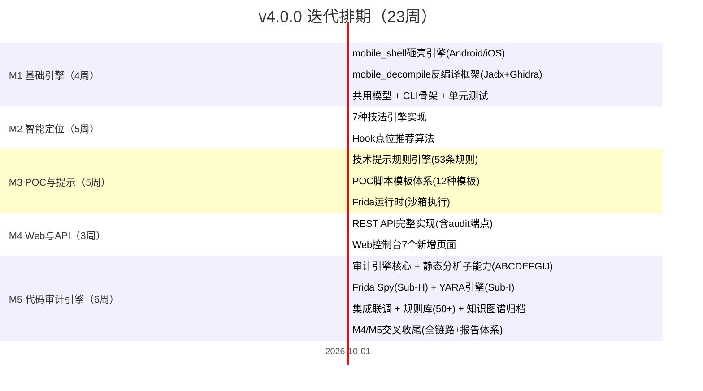

# 玄鉴 v4.0.0 移动安全逆向分析引擎 版本规划（定稿）

> 生成时间：2026-09-14 ｜ 基线：v3.3.0（tag `v3.3.0`）
> 主题：移动端安全分析全栈引擎 —— 砸壳·反编译·自动化Hook定位·关键性技术提示·Frida POC·App代码审计
> **规划依据**：隐雾App移动安全培训体系（67课时完整课程）技术提炼
> **最高约束：全程零危险操作。所有能力只读、只分析、只报告。**

---

## 〇、版本定位与战略意义

### 1.1 为什么是 v4.0

v1.x → v3.x 依次完成了「代码静态安全审计 → AI攻防 → 企业级 → Web化」的迭代演进。
**v4.0 开辟全新赛道：由服务端/Web代码审计，向移动端（Android/iOS）安全分析延展。**

| 维度 | v3.x 定位 | v4.0 新增 |
|------|---------|----------|
| 分析对象 | Java/Python/Go/JS源码 | Android APK + iOS IPA + Mach-O/DEX/SO |
| 技术路径 | 静态扫描 + AI攻防推理 | 动态(Frida) + 静态(反编译)双模态 |
| 核心动作 | 规则匹配 → 报告 | 脱壳→反编译→定位→Hook→POC→验证→审计 |
| 输出 | 漏洞报告 + Fix PR | 逆向分析报告 + Frida脚本POC + App安全审计报告 |

### 1.2 与现有产品关系

v4.0 不是替代 v3.x，而是**扩展出一个新的移动端分析引擎**：
- v3.x 扫描器体系 (semgrep/bandit/findsecbugs) → 继续服务服务端代码审计
- v4.0 新增移动引擎 (脱壳/反编译/Hook/POC) → 服务移动端安全分析与Hook验证
- v4.0 新增App审计引擎 (10维度静态+动态审计) → 对标MobSF的Android/iOS代码安全审查
- 共享：知识图谱、Web控制台、报告体系、权限模块

---

## 一、能力全景图

```
┌────────────────────────────────────────────────────────────────────────────────────┐
│                          玄鉴 v4.0 移动安全分析引擎                                   │
├────────────────────────────────────────────────────────────────────────────────────┤
│                                                                                    │
│  ┌─────────┐   ┌─────────┐   ┌──────────┐   ┌─────────┐   ┌──────┐   ┌───────────┐│
│  │ ① 砸壳  │ → │② 反编译 │ → ③ 自动化 │ → │④ 关键性 │ → │⑤Frida│ → │⑥ App审计 ││
│  │ (脱壳)  │   │ (多格式)│   │  Hook定位 │   │ 技术提示 │   │ POC  │   │ (全量)   ││
│  └─────────┘   └─────────┘   └──────────┘   └─────────┘   └──────┘   └───────────┘│
│       │              │              │              │            │           │       │
│  frida-ios-dump  jadx/JEB     7种定位技法    AI智能摘要    脚本生成   10项子能力 │
│  FART/Youpk     GDA/IDA       智能推荐      风险评级      模板匹配   Frida Spy  │
│  dump-decrypt   smali/伪代码  调用链追踪   修复建议      一键验证   YARA引擎   │
│                                                                                    │
├────────────────────────────────────────────────────────────────────────────────────┤
│                                  基础服务层                                          │
│  ┌──────────┐ ┌──────────┐ ┌──────────┐ ┌──────────┐ ┌──────────┐ ┌──────────┐   │
│  │ 设备管理 │ │ 文件解析 │ │ 脚本沙箱 │ │ 知识图谱 │ │ 报告引擎 │ │ 审计引擎 │   │
│  │ (adb/USB)│ │(APK/IPA) │ │ (隔离执行)│ │ (归档溯源)│ │ (多格式) │ │(规则+评分)│   │
│  └──────────┘ └──────────┘ └──────────┘ └──────────┘ └──────────┘ └──────────┘   │
└────────────────────────────────────────────────────────────────────────────────────┘
```

---

## 二、六大核心能力详细设计

### 2.1 能力①——砸壳（脱壳）

**能力定义**：对加密/加固的移动端安装包进行解密，输出可反编译的二进制文件。

#### 2.1.1 支持的脱壳场景

| 平台 | 脱壳目标 | 对应工具/方法 | 自动化程度 |
|------|---------|-------------|----------|
| iOS | App Store 加密IPA | frida-ios-dump、dump-decrypt、Clutch | 全自动(一键) |
| iOS | 企业签名IPA | bfdecrypt、CrackerXI(越狱插件) | 半自动(需越狱) |
| Android | 加固APK(360/腾讯/梆梆) | FART、Youpk、FRIDA-DEXDump | 全自动 |
| Android | 加壳SO(LLVM/VMP) | 基于IDA/Ghidra的静态脱壳 | 半自动 |
| Android | DEX完整性校验 | 内存dump + 修复工具链 | 全自动 |

#### 2.1.2 模块设计

```
mobile_shell/
├── core/
│   ├── __init__.py
│   ├── base.py              # ShellEngine 基类(抽象接口)
│   ├── ios_dumper.py        # iOS脱壳引擎(frida-ios-dump集成)
│   ├── android_dumper.py    # Android脱壳引擎(FART/Youpk)
│   └── detection.py          # 加固类型自动识别
├── integrations/
│   ├── frida_ios_dump.py    # frida-ios-dump CLI封装
│   ├── fart.py              # FART/A-Shell集成
│   ├── youpk.py             # Youpk脱壳集成
│   └── crackerxi.py         # CrackerXI插件封装
├── models/
│   ├── dump_result.py       # 脱壳结果数据模型
│   └── dump_config.py       # 脱壳配置(设备/端口/目标)
├── cli.py                   # CLI入口(fp-sentinel mobile shell ...)
└── tests/
    ├── test_ios_dumper.py
    ├── test_android_dumper.py
    └── test_detection.py
```

#### 2.1.3 核心接口

```python
class ShellEngine(ABC):
    """脱壳引擎抽象基类"""
    
    @abstractmethod
    async def detect_protection(self, target_path: str) -> ProtectionInfo:
        """自动识别加固类型"""
     ...

    
    @abstractmethod
    async def dump(self, target: DumpTarget, config: DumpConfig) -> DumpResult:
        """执行脱壳"""
        pass
    
    @abstractmethod
    def get_supported_formats(self) -> List[str]:
        """返回支持的文件格式"""
        pass

@dataclass
class DumpResult:
    """脱壳结果"""
    success: bool
    original_path: str           # 原始文件路径
    dumped_path: str             # 脱壳后文件路径
    protection_type: str         # 检测到的加固类型
    platform: Platform           # IOS / ANDROID
    file_format: FileFormat      # IPA / APK / MACH-O / DEX
    sha256_before: str
    sha256_after: str
    duration_sec: float
    logs: List[str]
    warnings: List[str]
```

#### 2.1.4 CLI 设计

```bash
# 自动识别加固类型
fp-sentinel mobile shell detect ./app.apk
# Output: {protection: "360加固", version: "v4.2", confidence: 0.95}

# iOS 一键脱壳(需已连接越狱设备)
fp-sentinel mobile shell dump-ios --app com.target.app --output ./dumped/
# Output: 生成 decrypted.ipa

# Android 脱壳(需已连接已root设备或模拟器)
fp-sentinel mobile shell dump-android --apk ./app.apk --output ./dumped/
# Output: 生成 app_dumped.apk/classes.dex

# 批量脱壳
fp-sentinel mobile shell batch-dump ./apps/ --platform all --output ./results/
```

---

### 2.2 能力②——反编译

**能力定义**：将脱壳后的二进制文件反编译为人类可读的源码/Smali/伪代码。

#### 2.2.1 支持的反编译目标

| 输入格式 | 平台 | 目标工具 | 输出格式 |
|---------|------|---------|---------|
| DEX/APK | Android | jadx | Java源码 |
| DEX/APK | Android | GDA | Java + Smali |
| DEX/APK | Android | JEB | Java(高质量) |
| Mach-O/IPA | iOS | IDA/Ghidra | 伪代码/C |
| Mach-O/IPA | iOS | class-dump | OC头文件 |
| SO/ELF | Android Native | Ghidra | C伪代码 |
| SO/ELF | Android Native | IDA Pro | 汇编+伪代码 |

#### 2.2.2 模块设计

```
mobile_decompile/
├── core/
│   ├── __init__.py
│   ├── base.py              # Decompiler 基类
│   ├── android_java.py      # Android Java层反编译(jadx/GDA/JEB)
│   ├── android_native.py    # Android Native层反编译(Ghidra/IDA)
│   └── ios_decompiler.py    # iOS反编译(IDA/class-dump/Hopper)
├── output/
│   ├── formatter.py         # 输出格式化(Java/Smali/伪代码统一)
│   ├── cross_reference.py   # 交叉引用分析
│   └── string_extractor.py  # 字符串提取
├── models/
│   ├── decompile_result.py  # 反编译结果模型
│   ├── class_info.py        # 类信息(包名/方法/属性)
│   └── method_info.py       # 方法信息(参数/返回/调用)
├── parsers/
│   ├── dex_parser.py        # DEX文件解析
├── cli.py                   # CLI入口
└── tests/
```

#### 2.2.3 核心接口

```python
class Decompiler(ABC):
    """反编译引擎抽象基类"""
    
    @abstractmethod
    async def decompile(self, target: str, config: DecompileConfig) -> DecompileResult:
        """执行反编译"""
        pass
    
    @abstractmethod
    def search_keyword(self, keyword: str, scope: str = None) -> List[SearchResult]:
        """关键字搜索(逆向核心)"""
        pass
    
    @abstractmethod
    def get_class_hierarchy(self) -> ClassHierarchy:
        """获取类层次结构"""
        pass

@dataclass
class DecompileResult:
    """反编译结果"""
    success: bool
    source_files: List[SourceFile]            # 源码文件列表
    class_count: int                          # 类数量
    method_count: int                         # 方法数量
    string_table: List[StringEntry]           # 字符串表
    manifest_info: Optional[ManifestInfo]     # Manifest信息
    call_graph: Optional[CallGraph]           # 调用图
    cross_references: Dict[str, List[str]]    # 交叉引用
    quality_score: float                      # 反编译质量评分
    duration_sec: float

@dataclass
class SearchResult:
    """搜索结果 - 关键代码定位的基础"""
    keyword: str
    file_path: str
    class_name: str
    method_name: str
    line_number: int
    code_snippet: str
    context_before: str                       # 上文(向前20行)
    context_after: str                        # 下文(向后20行)
    match_type: MatchType                     # TEXT / STRING / CALL / XREF
    relevance_score: float                    # 关联度评分
    
    # 关键性评分: 与包名相关性、是否业务逻辑类、是否核心方法
    critical_score: float                     # 0-1, 越高越关键
```

#### 2.2.4 CLI 设计

```bash
# APK完整反编译
fp-sentinel mobile decompile ./app.apk --engine jadx --format java 

# iOS二进制反编译
fp-sentinel mobile decompile ./App --engine ghidra --format pseudo-c

# 关键字搜索(跨类)
fp-sentinel mobile decompile ./app.apk --search "encrypt" --type method_call

# 字符串提取(找URL/密钥/接口)
fp-sentinel mobile decompile ./app.apk --strings --pattern "http|https|key|token|sign"

# 调用图生成
fp-sentinel mobile decompile ./app.apk --call-graph --format dot --output ./callgraph/
```

---

### 2.3 能力③——自动化 Hook 定位

**能力定义**：基于反编译结果 + 静态分析 + 动态追踪，自动化推荐最优 Hook 点位。

#### 2.3.1 七种关键定位技法（来自隐雾课程体系）

| # | 技法名称 | 原理描述 | 适用场景 | 自动化方式 |
|---|---------|---------|---------|----------|
| 1 | **关键字搜索定位** | 搜索请求接口名/参数名/encrypt等关键字 | 明文数据包定位 | 反编译全文检索 + 智能筛选 |
| 2 | **HashMap/ArrayList Hook** | Hook集合类打印调用栈 | 网络请求参数跟踪 | 脚本模板自动注入+输出解析 |
| 3 | **Toast Hook 调用栈** | Hook Toast显示方法打印调用栈 | UI相关功能定位 | 脚本模板+调用栈回溯 |
| 4 | **Log日志定位** | Hook Log类获取调试日志 | 开发埋点追查 | 脚本模板+日志解析 |
| 5 | **JSON定位** | Hook JSON序列化/反序列化 | API数据加解密定位 | 脚本模板追踪JSON流 |
| 6 | **String转byte[]定位** | Hook字符串编码转换 | 加解密入口定位 | 脚本模板+编码参数追踪 |
| 7 | **Base64编码定位** | Hook Base64.encode/decode | 明文/密文边界定位 | 脚本模板+解码追踪 |

#### 2.3.2 Hook 点位推荐引擎

```
mobile_hook/
├── core/
│   ├── __init__.py
│   ├── base.py                   # HookLocator 基类
│   ├── keyword_engine.py         # 关键字搜索引擎
│   ├── call_chain_analyzer.py    # 调用链分析器
│   └── critical_scorer.py        # 关键性评分引擎
├── techniques/
│   ├── keyword_search.py         # 技法1: 关键字定位
│   ├── collection_hook.py        # 技法2: 集合类Hook
│   ├── toast_hook.py             # 技法3: Toast调用栈
│   ├── log_hook.py               # 技法4: 日志Hook
│   ├── json_hook.py              # 技法5: JSON追踪
│   ├── string_hook.py            # 技法6: String编码追踪
│   └── base64_hook.py            # 技法7: Base64追踪
├── dynamic/
│   ├── frida_tracer.py           # frida-trace封装
│   ├── stalker.py                # Frida Stalker(指令级追踪)
│   └── watcher.py                # 内存Watcher(API调用监视)
├── models/
│   ├── hook_point.py             # Hook点位数据模型
│   ├── hook_recommendation.py    # Hook推荐结果
│   └── technique_result.py       # 技法执行结果
├── cli.py
└── tests/
```

#### 2.3.3 核心算法 —— Hook 点位推荐流程

```
输入: APK/IPA + 目标(加密定位/签名绕过/越狱检测/组件漏洞)
      │
      ▼
  ┌──────────────┐
  │ 1. 静态预分析 │ ← 反编译结果
  │ · 提取字符串  │
  │ · 识别加密类  │
  │ · 定位网络库  │
  └──────┬───────┘
         │
         ▼
  ┌──────────────┐
  │ 2. 关键字粗筛 │ ← 7种技法的关键字规则
  │ · 包名相关性  │
  │ · 类名匹配    │
  │ · 方法特征    │
  └──────┬───────┘
         │
         ▼
  ┌──────────────┐
  │ 3. 调用链追踪 │ ← 类间调用关系图
  │ · 入口→出口  │
  │ · 数据流向    │
  │ · 最短路径    │
  └──────┬───────┘
         │
         ▼
  ┌──────────────┐
  │ 4. 关键性评分 │ ← 多维度权重评分
  │ · 包名相关30% │
  │ · 方法特征25% │
  │ · 调用链15%  │
  │ · 字符串特征20%│
  │ · 历史经验10% │
  └──────┬───────┘
         │
         ▼
  ┌──────────────┐
  │ 5. Top-N推荐  │ ← 输出Hook点位列表 + 置信度
  │ + 技法匹配    │
  │ + 预估成功率  │
  └──────────────┘
```

#### 2.3.4 CLI 设计

```bash
# 自动化推荐Hook点位(加密定位场景)
fp-sentinel mobile hook recommend ./app.apk --goal encrypt-trace
# Output:
#   Rank  Class                              Method              Score  Technique
#   1     com.network.EncryptUtil            encrypt(byte[])     0.92   keyword
#   2     com.crypto.AESHelper               doFinal(byte[])     0.87   base64
#   3     okhttp3.Intercept                  intercept(Chain)    0.81   collection

# 执行单一技法
fp-sentinel mobile hook technique base64 --apk ./app.apk --output ./trace.json

# 组合技法扫描
fp-sentinel mobile hook scan ./app.apk --techniques all --goal request-plaintext

# 验证Hook点位(连接设备后动态验证)
fp-sentinel mobile hook verify ./hook_point.json --device <serial>
```

---

### 2.4 能力④——关键性技术提示

**能力定义**：在逆向分析的关键节点，自动输出结构化的技术指引和下一步建议。

#### 2.4.1 触发场景与提示类型

| 触发场景 | 提示类型 | 示例内容 |
|---------|---------|---------|
| 发现加密算法 | **算法识别提示** | "检测到AES/CBC/PKCS5Padding, hook javax.crypto.Cipher.doFinal()可获取密文" |
| 遇到签名校验 | **签名绕过提示** | "MD5签名拼接模式，hook java.lang.StringBuilder.toString()定位拼接点" |
| 存在加固壳 | **加固识别提示** | "检测到360加固，推荐使用FRIDA-DEXDump脱壳，脱壳成功率92%" |
| 发现root/越狱检测 | **反检测提示** | "检测到5处root检测，hook java.io.File.exists()返回false可绕过" |
| 证书绑定 | **SSL Pinning绕过** | "检测到okhttp3.CertificatePinner，hook check()方法可绕过" |
| 组件导出异常 | **组件风险提示** | "Activity com.app.LoginActivity exported=true, 可被第三方唤起" |
| 数据明文泄露 | **泄露告警提示** | "Log.d()输出包含Token, 需检查生产环境是否关闭调试日志" |
| 硬编码敏感信息 | **凭证告警提示** | "发现3处硬编码AES密钥 + 2处测试环境API Token" |
| 动态注册Receiver | **风险提示** | "Runtime.registerReceiver()动态注册, 存在隐式Intent劫持风险" |
| PendingIntent使用 | **Intent劫持提示** | "FLAG_IMMUTABLE未设置, PendingIntent可被修改" |

#### 2.4.2 提示规则引擎

```
mobile_insight/
├── core/
│   ├── __init__.py
│   ├── engine.py              # 提示规则引擎
│   ├── context.py             # 分析上下文管理
│   └── priority.py            # 优先级排序
├── rules/
│   ├── crypto_rules.py        # 算法规则(15+)
│   ├── network_rules.py       # 网络安全规则(10+)
│   ├── storage_rules.py       # 存储安全规则(8+)
│   ├── component_rules.py     # 组件安全规则(12+)
│   ├── anti_analysis_rules.py # 反分析检测规则(10+)
│   └── privacy_rules.py       # 隐私合规规则(8+)
├── nlp/
│   ├── code_summarizer.py     # 代码摘要(基于LLM)
│   ├── tip_formatter.py       # 提示格式化
│   └── recommendation.py      # 修复建议生成
├── models/
│   ├── insight.py             # 提示数据模型
│   ├── insight_category.py    # 提示分类
│   └── rule_match.py          # 规则匹配结果
├── cli.py
└── tests/
```

#### 2.4.3 核心模型

```python
@dataclass
class TechnicalInsight:
    """关键技术提示"""
    id: str
    title: str                           # 提示标题
    category: InsightCategory            # CRYPTO/NETWORK/STORAGE/COMPONENT/ANTI/Privacy
    severity: Severity                   # CRITICAL/HIGH/MEDIUM/LOW
    confidence: float                    # 置信度 0-1
    
    description: str                     # 问题描述
    affected_component: str              # 受影响组件
    code_reference: CodeLocation         # 代码位置
    
    technical_context: str               # 技术上下文(给分析的指引)
    suggested_technique: HookTechnique   # 建议使用的技法
    estimated_difficulty: DifficultyLevel # 估计难度(低/中/高)
    
    next_steps: List[str]                # 后续步骤建议
    related_rules: List[str]             # 关联的CWE/OWASP
    references: List[str]                # 参考文档链接
    
    auto_fixable: bool                   # 是否可自动生成修复
    fix_hint: Optional[str] = None       # 修复提示
```

#### 2.4.4 CLI 设计

```bash
# 全量技术提示
fp-sentinel mobile insight ./app.apk --output ./insights.json

# 按类别筛选
fp-sentinel mobile insight ./app.apk --category crypto,network --min-severity HIGH

# 交互式提示模式(分析哪个显示哪个)
fp-sentinel mobile insight ./app.apk --interactive

# 修复建议
fp-sentinel mobile insight ./app.apk --include-fix --format markdown
```

---

### 2.5 能力⑤——Frida 脚本 POC 自动生成

**能力定义**：基于 Hook 点位推荐 + 技术提示，自动生成可运行的 Frida 脚本 POC。

#### 2.5.1 脚本模板体系

| 模板类型 | 目标场景 | 输出格式 | 说明 |
|---------|---------|---------|------|
| **参数打印模板** | 通用方法Hook | .js | 打印入参和返回值 |
| **返回值修改模板** | 逻辑绕过 | .js | 修改函数返回值 |
| **参数替换模板** | 数据包篡改 | .js | 修改函数入参 |
| **调用栈打印模板** | 调用链追踪 | .js | 打印完整Java调用栈 |
| **字符串转储模板** | 加解密追踪 | .js | 字节数组/String互转打印 |
| **JSON Hook模板** | API数据 | .js | Hook JSON序列化/反序列化 |
| **HashMap遍历模板** | 参数集合 | .js | 遍历打印HashMap内容 |
| **证书绕过模板** | SSL Pinning | .js | 绕过证书绑定 |
| **越狱检测绕过模板** | 环境检测 | .js | 伪造检测状态(返回false) |
| **签名计算Hook模板** | 签名分析 | .js | 拦截签名计算过程 |
| **数据转发模板** | 明文转发Burp | .py + .js | 明文数据Python中转Frida↔Burp |
| **主动调用模板** | 加解密爆破 | .js | 主动调用加解密方法 |

#### 2.5.2 POC 生成 Pipeline

```
输入: 分析目标 + Hook点位 + 意图(抓取明文/绕过检测/篡改参数/分析签名)
      │
      ▼
  ┌────────────────┐
  │ 1. 模板选择     │ ← 12种脚本模板库
  │ (意图→模板映射)  │
  └───────┬────────┘
          │
          ▼
  ┌────────────────┐
  │ 2. 参数填充     │ ← 从Hook点位提取:
  │ · 完全限定类名  │
  │ · 方法名        │
  │ · 方法签名(重载)│
  │ · 参数类型列表  │
  └───────┬────────┘
          │
          ▼
  ┌────────────────┐
  │ 3. 代码生成     │ ← 模板引擎渲染
  │ · Java Hook片段 │
  │ · OC Hook片段   │
  │ · Native Hook   │
  │ · RPC交互代码   │
  └───────┬────────┘
          │
          ▼
  ┌────────────────┐
  │ 4. 安全注记     │ ← 自动添加:
  │ · 功能说明注释  │
  │ · 风险提示注释  │
  │ · 使用方法注释  │
  └───────┬────────┘
          │
          ▼
  ┌────────────────┐
  │ 5. 质量校验     │ ← 语法检查 + 模板合规
  │ · JS语法检查    │
  │ · API使用合规   │
  │ · 占位符检查    │
  └────────────────┘
```

#### 2.5.3 模块设计

```
mobile_poc/
├── core/
│   ├── __init__.py
│   ├── generator.py          # POC生成器主类
│   ├── template_engine.py    # 模板渲染引擎
│   └── validator.py          # POC校验器
├── templates/
│   ├── java/
│   │   ├── basic_hook.js.tmpl         # 基础方法Hook
│   │   ├── overload_hook.js.tmpl      # 重载方法Hook
│   │   ├── constructor_hook.js.tmpl   # 构造方法Hook
│   │   ├── static_hook.js.tmpl        # 静态方法Hook
│   │   ├── param_modify.js.tmpl       # 参数修改
│   │   ├── return_modify.js.tmpl      # 返回值修改
│   │   ├── callstack_print.js.tmpl    # 调用栈打印
│   │   ├── string_dump.js.tmpl        # 字符串转储
│   │   ├── bytearray_print.js.tmpl    # 字节数组打印
│   │   ├── hashmap_hook.js.tmpl       # HashMap遍历
│   │   └── json_hook.js.tmpl          # JSON序列化Hook
│   ├── ios/
│   │   ├── oc_basic.js.tmpl           # OC方法Hook
│   │   ├── oc_replace.js.tmpl         # OC方法替换
│   │   ├── oc_fuzzy.js.tmpl           # OC模糊匹配
│   │   ├── oc_addr_hook.js.tmpl       # 地址Hook
│   │   └── oc_stalker.js.tmpl         # OC指令追踪
│   ├── native/
│   │   ├── so_hook.js.tmpl            # .so函数Hook
│   │   └── inline_hook.js.tmpl        # Inline Hook
│   └── combo/
│       ├── plaintext_capture.py.tmpl  # 明文抓取(Python+JS)
│       ├── sign_bypass.py.tmpl        # 签名绕过
│       ├── ssl_bypass.js.tmpl         # 证书绑定绕过
│       └── root_bypass.js.templ        # Root检测绕过
├── runtime/
│   ├── frida_client.py       # Frida客户端封装(rpc模式)
│   ├── device_manager.py     # 设备管理
│   └── script_executor.py    # 脚本执行器
├── models/
│   ├── poc_result.py         # POC结果模型
│   └── template_config.py    # 模板配置
├── cli.py
└── tests/
```

#### 2.5.4 CLI 设计

```bash
# 基于Hook点位自动生成POC脚本
fp-sentinel mobile poc generate --hook-point ./hook_point.json --template basic_hook

# 一键生成明文抓包脚本(Python+Frida)
fp-sentinel mobile poc generate --goal plaintext-capture --apk ./app.apk --output ./scripts/

# 生成签名绕过脚本
fp-sentinel mobile poc generate --goal sign-bypass --apk ./app.apk

# 生成证书绑定绕过
fp-sentinel mobile poc generate --goal ssl-bypass --apk ./app.apk

# 生成越狱/Root检测绕过
fp-sentinel mobile poc generate --goal root-bypass --apk ./app.apk

# 生成组件漏洞POC(Activity劫持/Intent注入)
fp-sentinel mobile poc generate --goal component-exploit --component com.app.LoginActivity

# 执行POC(连接设备自动注入)
fp-sentinel mobile poc run ./script.js --device <serial> --auto-start

# 批量生成(针对多个Hook点位)
fp-sentinel mobile poc batch --hook-points ./points.json --output ./poc_suite/
```

---

### 2.6 能力⑥——App 全量代码审计

**能力定义**：以 OWASP MASWE / CWE 为基准，对 APK/IPA 实施系统化静态代码审计，覆盖 Manifest 配置、组件暴露、网络配置、凭证泄露、第三方依赖等 10 大维度，自动输出结构化安全审计报告。

> **设计思路借鉴**：MobSF（21.3k stars）的静态+动态一体化扫描框架、ai-mobile-reverse-skills 的六阶段总控编排模式、Frida-Script-Runner 的 Web 化 REPL 执行引擎。

#### 2.6.1 十大审计子能力

| # | 子能力 | 对标标准 | 检测范围 | 关联能力 |
|---|--------|---------|---------|---------|
| A | **Manifest 安全审计** | OWASP MASVS-L1 | 过度权限申请、组件未导出保护、allowBackup/usesCleartextTraffic 误配、DeepLink 劫持面 | 承接①②③ |
| B | **源码静态扫描** | OWASP MASWE / CWE | 业务逻辑缺陷、不安全编码模式、废弃API残留、危险函数调用 | 承接②③ |
| C | **第三方 SDK/依赖分析** | CVE / GHSA / OSS | 已知漏洞版本关联、License合规、SDK权重评估、热修复框架风险 | 承接② |
| D | **硬编码敏感信息检测** | CWE-798 / MASWE | AES/RSA密钥、Bearer Token、数据库连接串、内网URL、调试凭证 | 承接②④ |
| E | **组件安全审计** | OWASP MSTG / CWE | Activity/Service/Broadcast/Provider Intent劫持、Fragment注入、WebView JS Bridge风险 | 承接③⑤ |
| F | **网络安全配置审计** | OWASP MASVS-NET | 明文流量、SSL证书绑定实现、代理检测机制、HostnameVerifier绕过面 | 承接②④ |
| G | **文件权限与存储审计** | OWAPP MASVS-STORAGE | World-Accessible文件、Path Traversal、外部存储敏感落盘、SharedPreferences明文 | 承接② |
| H | **动态行为监控（Frida Spy）** | 运行时追踪 | 运行时API调用序列、敏感数据采集点、反射与动态加载、隐私合规行为 | 承接③⑤ |
| I | **病毒/恶意代码特征** | YARA规则 | 已知木马/广告/间谍代码特征、加壳器指纹、Rootkit行为、勒索特征 | 承接①② |
| J | **API 端点画像** | 自动提取+关联 | URL接口枚举、请求/响应结构重建、鉴权模式识别、敏感接口分类 | 承接②③④ |

#### 2.6.2 与其他五大能力的联动矩阵

```
┌──────────────────────────────────────────────────────────────────────┐
│                      能力联动拓扑                                      │
├──────────────────────────────────────────────────────────────────────┤
│                                                                      │
│   ①砸壳 ──→ ②反编译 ──→ ③自动化Hook定位 ──→ ④技术提示 ──→ ⑤Frida POC│
│      │           │              │               │             │     │
│      │           │              │               │             │     │
│      └───────────┼──────────────┼───────────────┼─────────────┘     │
│                  │              │               │                    │
│                  ▼              ▼               ▼                    │
│              ┌──────────────────────────────────────┐                 │
│              │   ⑥ App 全量代码审计                   │                │
│              │   · Manifest/组件/网络/存储静态审查    │                │
│              │   · 动态Frida Spy 交叉验证             │                │
│              │   · SDK/API画像 反哺Hook定位           │                │
│              │   · 审计发现 → 增强技术提示规则库       │                │
│              │   · 漏洞定位 → 驱动POC脚本靶向生成      │                │
│              └──────────────────────────────────────┘                 │
│                                                                      │
└──────────────────────────────────────────────────────────────────────┘
```

#### 2.6.3 模块设计

```
mobile_audit/
├── core/
│   ├── __init__.py
│   ├── engine.py              # AuditEngine 主引擎(流水线编排)
│   ├── runner.py              # 10个子分析器的注册与调度
│   └── reporter.py            # 审计报告生成器(多格式)
├── checks/
│   ├── manifest_audit.py      # A: Manifest安全审计
│   ├── static_scan.py         # B: 源码静态扫描(Semgrep/MobSF规则适配)
│   ├── sdk_analyzer.py        # C: 第三方SDK/依赖分析
│   ├── secret_detector.py     # D: 硬编码敏感信息检测
│   ├── component_audit.py     # E: 组件安全审计
│   ├── network_audit.py       # F: 网络安全配置审计
│   ├── storage_audit.py       # G: 文件权限与存储审计
│   ├── frida_spy.py           # H: 动态行为监控(Frida运行时追踪)
│   ├── yara_engine.py         # I: YARA规则引擎(已知恶意代码特征匹配)
│   └── api_profiler.py        # J: API端点画像提取与关联分析
├── rules/
│   ├── owasp_maswe/           # OWASP MASWE 规则集(50+)
│   ├── cwe/                   # CWE 拓扑映射规则
│   ├── yara_rules/            # YARA 恶意代码特征库
│   └── custom/                # 用户自定义规则
├── integrations/
│   ├── frida_spy_bridge.py    # Frida Spy ↔ 审计引擎桥接
│   ├── jadx_mcp.py            # JADX MCP 集成(反编译源码语义增强)
│   └── ghidra_mcp.py          # Ghidra MCP 集成(原生代码审计)
├── models/
│   ├── audit_result.py        # 审计结果聚合模型
│   ├── finding.py             # 单条发现(CVE/CWE/MASWE映射)
│   └── score.py              # 风险评分(CVSSv3 + 自定义权重)
├── cli.py
└── tests/
```

#### 2.6.4 核心接口

```python
class AuditEngine:
    """App全量代码审计主引擎"""

    async def audit(self, target: str, config: AuditConfig) -> AuditResult:
        """执行全量审计流水线"""

    async def audit_subset(self, target: str, checks: List[str]) -> AuditResult:
        """执行指定子能力的轻量审计"""

    def register_rule_pack(self, pack: RulePack) -> None:
        """动态注册规则集(支持热更新)"""

    def export_report(self, result: AuditResult, fmt: ReportFormat) -> str:
        """导出审计报告(Markdown/HTML/JSON/PDF)"""


@dataclass
class AuditResult:
    """审计结果"""
    success: bool
    target: str
    platform: Platform
    duration_sec: float
    findings: List[Finding]               # 全部发现清单
    summary: AuditSummary                 # 统计摘要(严重度分布/Top风险)
    risk_score: float                     # 综合风险评分 0-10
    coverage: CoverageReport              # 规则覆盖率
    api_profile: Optional[APIProfile]     # API端点画像
    sdk_inventory: List[SDKInfo]          # 第三方SDK清单
    class_hierarchy: Optional[ClassHierarchy]  # 类层次结构(复用反编译)


@dataclass
class Finding:
    """单条审计发现"""
    id: str                               # 唯一标识
    title: str                            # 发现标题
    category: AuditCategory               # MANIFEST/STATIC/SDK/SECRET/COMPONENT/NETWORK/STORAGE/BEHAVIOR/YARA/API
    severity: Severity                    # CRITICAL/HIGH/MEDIUM/LOW/INFO
    confidence: float                     # 置信度 0-1
    cwe_id: Optional[str]                 # CWE编号
    maswe_id: Optional[str]               # MASWE编号
    cvss_score: Optional[float]           # CVSSv3评分
    location: CodeLocation                # 代码位置
    description: str                      # 问题描述
    remediation: str                      # 修复建议
    hook_point: Optional[HookPoint]       # 关联的Hook点位(联动③)
    poc_template: Optional[str]           # 推荐的POC模板(联动⑤)
    references: List[str]                 # 参考文档链接
```

#### 2.6.5 CLI 设计

```bash
# 全量审计(10个子能力全部执行)
fp-sentinel mobile audit full ./app.apk --output ./audit_report/

# 子能力独立审计
fp-sentinel mobile audit manifest ./app.apk                     # Manifest审计
fp-sentinel mobile audit static ./app.apk --rules owasp_maswe    # 静态扫描
fp-sentinel mobile audit sdk ./app.apk                           # SDK/依赖分析
fp-sentinel mobile audit secrets ./app.apk --entropy-threshold 4 # 硬编码检测
fp-sentinel mobile audit component ./app.apk                     # 组件审计
fp-sentinel mobile audit network ./app.apk                       # 网络配置审计
fp-sentinel mobile audit storage ./app.apk                       # 存储审计
fp-sentinel mobile audit dynamic --device <serial>               # Frida动态监控
fp-sentinel mobile audit yara ./app.apk --rule-packs default     # 恶意代码特征
fp-sentinel mobile audit api ./app.apk --format openapi          # API端点画像

# 批量审计
fp-sentinel mobile audit batch ./apps/ --output ./reports/

# 执行动态监控(需连接设备)
fp-sentinel mobile audit spy --apk ./app.apk --device <serial> --duration 60s

# 导出报告(多格式)
fp-sentinel mobile audit report ./audit.json --format html --template full
fp-sentinel mobile audit report ./audit.json --format pdf  --template executive
fp-sentinel mobile audit report ./audit.json --format json --schema cyclonedx  # SBOM输出
```

#### 2.6.6 Frida Spy 审计模式说明

"审计仪表盘"页面的 **动态监控** 子面板基于 Frida Spy 机制实现，仅对已授权设备安装 Frida Gadget 进行 API 调用轨迹追踪，典型能力：

| 监控维度 | Hook 目标 | 审计价值 | 规避检测 |
|---------|----------|---------|---------|
| 文件 I/O | `android.os.File` / `java.io.FileInputStream` | 检测外部存储敏感落盘 | 只读Hook，不修改返回值 |
| 网络请求 | `okhttp3.OkHttpClient` / `HttpURLConnection` | API流量重建 + 明文泄露检测 | 不拦截，仅采集 |
| 加解密调用 | `javax.crypto.Cipher` / `MessageDigest` | 弱算法/ECB模式/密钥复用识别 | 不获取明文密钥 |
| 隐私数据采集 | `TelephonyManager` / `LocationManager` | 合规审计(IMEI/GPS超范围采集) | 返回空值伪数据 |
| WebView JSBridge | `WebView.addJavascriptBridge` | 不安全JS桥暴露检测 | 不修改Bridge行为 |
| 反射调用 | `java.lang.reflect.Method.invoke` | 动态加载/反调试检测 | 仅记录调用序列 |

> **安全约束**：Frida Spy 仅执行性能监控所需的轻量级 Hook，不修改 app 运行时不变量，不篡改业务逻辑，符合第5章 M1-M8 红线要求。

---

## 三、整体技术架构

### 3.1 模块布局

```
fp_sentinel/
├── mobile/                    # 🆕 v4.0 移动端引擎
│   ├── __init__.py
│   ├── shell/                 # ① 砸壳引擎
│   │   ├── core/
│   │   ├── integrations/
│   │   └── cli.py
│   ├── decompile/             # ② 反编译引擎
│   │   ├── core/
│   │   ├── output/
│   │   ├── parsers/
│   │   └── cli.py
│   ├── hook/                  # ③ Hook定位引擎
│   │   ├── core/
│   │   ├── techniques/
│   │   ├── dynamic/
│   │   └── cli.py
│   ├── insight/               # ④ 技术提示引擎
│   │   ├── core/
│   │   ├── rules/
│   │   ├── nlp/
│   │   └── cli.py
│   ├── poc/                   # ⑤ Frida POC生成
│   │   ├── core/
│   │   ├── templates/
│   │   ├── runtime/
│   │   └── cli.py
│   ├── audit/                 # ⑥ App全量代码审计
│   │   ├── core/
│   │   ├── checks/
│   │   ├── rules/
│   │   ├── integrations/
│   │   ├── models/
│   │   └── cli.py
│   ├── common/                # 共享模型与工具
│   │   ├── models.py
│   │   ├── platform.py
│   │   ├── device_connector.py
│   │   └── file_resolver.py
│   └── cli.py                 # 统一入口: fp-sentinel mobile <subcommand>
│
├── api/
│   └── mobile_routes.py       # 🆕 /api/mobile/* REST端点
│
├── web/
│   └── pages/
│       ├── mobile-analyzer/    # 🆕 Web: 移动分析工作台
│       ├── hook-locator/       # 🆕 Web: Hook定位可视化
│       ├── poc-runner/         # 🆕 Web: POC在线执行
│       ├── insight-dashboard/  # 🆕 Web: 技术提示面板
│       ├── audit-dashboard/    # 🆕 Web: 审计仪表盘
│       └── audit-detail/       # 🆕 Web: 详细审计报告
│
├── knowledge_graph/
│   └── modules/
│       ├── v4_mobile_shell/        # 知识图谱归档
│       ├── v4_mobile_decompile/
│       ├── v4_mobile_hook/
│       ├── v4_mobile_insight/
│       ├── v4_mobile_poc/
│       └── v4_mobile_audit/
│
├── attack/                    # v3.x 攻防(复用)
├── ...                        # 其他已有模块
```

### 3.2 REST API 设计

| 端点 | 方法 | 功能 | 所属能力 |
|------|------|------|---------|
| `/api/mobile/shell/detect` | POST | 加固类型检测 | ①砸壳 |
| `/api/mobile/shell/dump` | POST | 执行脱壳 | ①砸壳 |
| `/api/mobile/decompile` | POST | 反编译 | ②反编译 |
| `/api/mobile/search` | POST | 关键字搜索 | ②反编译 |
| `/api/mobile/hook/recommend` | POST | Hook点位推荐 | ③Hook定位 |
| `/api/mobile/hook/technique` | POST | 执行技法 | ③Hook定位 |
| `/api/mobile/insight` | POST | 获取技术提示 | ④技术提示 |
| `/api/mobile/poc/generate` | POST | 生成POC脚本 | ⑤Frida POC |
| `/api/mobile/poc/run` | POST | 执行POC | ⑤Frida POC |
| `/api/mobile/audit/full` | POST | 全量审计（10项子能力） | ⑥代码审计 |
| `/api/mobile/audit/manifest` | POST | Manifest安全审计 | ⑥代码审计 |
| `/api/mobile/audit/static` | POST | 源码静态扫描 | ⑥代码审计 |
| `/api/mobile/audit/sdk` | POST | 第三方SDK/依赖分析 | ⑥代码审计 |
| `/api/mobile/audit/secrets` | POST | 硬编码敏感信息检测 | ⑥代码审计 |
| `/api/mobile/audit/component` | POST | 组件安全审计 | ⑥代码审计 |
| `/api/mobile/audit/network` | POST | 网络安全配置审计 | ⑥代码审计 |
| `/api/mobile/audit/storage` | POST | 文件权限与存储审计 | ⑥代码审计 |
| `/api/mobile/audit/spy` | POST | Frida动态行为监控（需设备） | ⑥代码审计 |
| `/api/mobile/audit/yara` | POST | 病毒/恶意代码特征扫描 | ⑥代码审计 |
| `/api/mobile/audit/api-profile` | POST | API端点画像提取 | ⑥代码审计 |
| `/api/mobile/audit/report` | GET | 获取审计报告（多格式导出） | ⑥代码审计 |
| `/api/mobile/audit/findings` | GET | 查询审计发现列表（分页/过滤） | ⑥代码审计 |
| `/api/mobile/analysis/report` | GET | 全链路分析报告（含审计） | 综合 |

### 3.3 Web 控制台新增页面（7页）

| 页面 | 路径 | 核心功能 | 前端亮点 | 所属能力 |
|------|------|---------|---------|---------|
| **移动分析工作台** | `#/mobile-analyzer` | APK/IPA上传 → 一键分析(脱壳+反编译+定位+提示+审计) | 分析流水线可视化 + 进度实时流 | ①-⑥ 综合 |
| **Hook定位可视化** | `#/hook-locator` | Hook点位推荐列表 + 调用链图 + 技法匹配 | Cytoscape.js 调用链图 + 置信度热力图 | ③Hook定位 |
| **POC生成器** | `#/poc-runner` | 模板选择 → 参数配置 → 脚本生成 → 在线执行 | Monaco Editor语法高亮 + 设备状态面板 | ⑤Frida POC |
| **技术提示面板** | `#/insight-dashboard` | 按类别/严重度排列的技术提示流 | 卡片流 + 一键跳转到代码 | ④技术提示 |
| **审计仪表盘** | `#/audit-dashboard` | 审计总览/风险评分/发现趋势/子能力分布 | ECharts可视化 + Frida Spy实时面板 | ⑥代码审计 |
| **审计报告详情** | `#/audit-detail` | 单条审计发现详情 + CVE/CWE映射 + 修复建议 | Markdown渲染 + 代码片段关联 | ⑥代码审计 |
| **报告中心** | `#/mobile-reports` | 移动端分析报告列表 + 详情(含审计报告) | Markdown渲染 + POC附件 + SBOM导出 | 综合 |

---

## 四、数据流与依赖关系

### 4.1 分析流水线(端到端)

```
用户上传 APK/IPA
       │
       ├───────────── shell/detect ────→ 加固类型置信度
       │                                    │ (如有壳)
       ▼                                    ▼
┌─────────────┐    shell/dump      ┌──────────────────┐
│ 加固检测     │ ──────────────────→│ 脱壳              │
└──────┬──────┘                      │ 输出: 解密APK/DEX│
       │                            └────────┬─────────┘
       │                                     │
       │                                     ▼
       │                            ┌──────────────────┐
       │                            │ 反编译            │
       │                            │ 输出: Java源码    │
       │                            │    +字符串表      │
       │                            │    +调用图        │
       │                            └────────┬─────────┘
       │                                     │
       │                    ┌────────────────┼────────────────┐
       │                    │                │                │
       │                    ▼                │                ▼
       │           ┌────────────────┐        │      ┌──────────────────┐
       │           │ 代码审计(静态)  │        │      │ 关键字搜索        │
       │           │ 10项子能力      │        │      └────────┬─────────┘
       │           │ (A-G, I, J)    │        │               │
       │           └───────┬────────┘        │               ▼
       │                   │                 │      ┌──────────────────┐
       │                   │                 │      │ Hook点位推荐      │
       │                   │                 │      └────────┬─────────┘
       │                   │                 │               │
       │                   │                 │               ▼
       │                   │                 │      ┌──────────────────┐
       │                   │                 │      │ 技术提示          │
       │                   │                 │      └────────┬─────────┘
       │                   │                 │               │
       │                   │                 │               ▼
       │                   │                 │      ┌──────────────────┐
       │                   │                 │      │ POC生成           │
       │                   │                 │      └────────┬─────────┘
       │                   │                 │               │ (可选)
       │                   │                 │               ▼
       │                   │                 │      ┌──────────────────┐
       │                   │                 │      │ 动态验证(Frida)   │
       │                   │                 │      └────────┬─────────┘
       │                   │                 │               │
       │                   │                 │               ▼
       │                   │                 │      ┌──────────────────┐
       │                   │                 │      │ 代码审计(动态)    │
       │                   │                 │      │ Frida Spy(Sub-H) │
       │                   │                 │      └────────┬─────────┘
       │                   │                 │               │
       └───────────────────┴─────────────────┴───────────────┘
                                   │
                                   ▼
                          ┌──────────────────┐
                          │ 生成报告          │
                          │ (逆向+审计综合)   │
                          │ Markdown/HTML    │
                          │ + SBOM(CycloneDX)│
                          └──────────────────┘
```

> **说明**: 静态审计(A-G、I、J) 在反编译完成后即可启动，无需等待动态Frida链路完成，二者结果在最终报告生成环节汇合；Frida Spy(Sub-H)需在设备连接完成后执行，作为静态审计的动态补充与交叉验证。

### 4.2 外部依赖分类

| 依赖类型 | 组件 | 用途 | 优先级 |
|---------|------|------|--------|
| **Python工具** | frida / frida-tools | Frida客户端 + 脚本注入 | P0 |
| **Python库** | androguard | APK静态分析(DEX解析) | P0 |
| **Python库** | javaobj | DEX头解析 | P1 |
| **Python库** | yara-python | YARA规则引擎(恶意代码特征匹配) | P0 |
| **Python库** | lief | ELF/Mach-O二进制解析(Native审计) | P1 |
| **Python库** | oss-audit-tool | 第三方SDK版本漏洞关联 | P1 |
| **系统工具** | jadx | 反编译引擎 | P0 |
| **系统工具** | apktool | APK解包/重打包 | P1 |
| **系统工具** | adb | 设备连接 | P0 |
| **系统工具** | 7zip | 压缩包解压 | P1 |
| **可选工具** | JEB | 高质量反编译(付费) | P2 |
| **可选工具** | Ghidra | 反编译/反汇编(NSA开源) | P1 |
| **可选工具** | IDA Pro | 专业反汇编/调试(付费) | P2 |

---

## 五、安全红线（v4.0 特有 + v3.x 继承）

### 5.1 v4.0 新增红线

| # | 红线 | 技术落实 |
|---|------|---------|
| M1 | **禁止向非授权设备注入脚本** | POC执行必须验证设备序列号在授权列表内 |
| M2 | **禁止外发Hook截获数据** | Hook数据仅存储于本地SQLite，禁止任何网络发送 |
| M3 | **禁止修改目标APK/IPA** | 所有操作在内存/脱副副本执行，不修改原始文件 |
| M4 | **POC脚本沙箱执行** | Frida注入必须在独立进程空间，禁止访问非目标进程 |
| M5 | **禁止保留脱壳产物超过7天** | 自动清理脱壳后的 IPA/DEX，只保留分析报告 |
| M6 | **Hook脚本使用范围限制** | 生成的POC脚本只能Hook用户授权的app包名 |
| M7 | **禁止自动化exploit** | POC仅用于抓包/参数打印/返回值修改，禁止提权/注入/持久化 |
| M8 | **数据流加密** | 明文抓包模式下的数据通过加密内存通道传输 |
| M9 | **审计发现不外发** | 审计发现清单（含敏感信息）仅存储于本地加密SQLite，禁止外发至任何远端 |
| M10 | **YARA规则来源可信** | 规则库仅从官方/签名源下载，禁止自动加载第三方不可信规则 |
| M11 | **Frida Spy审计沙箱** | 动态监控在独立进程空间执行，不修改app运行时状态，仅限已授权设备 |

### 5.2 v3.x 红线继承（S1-S9）

全部继承 v3.3.0 迭代计划第九章定义的9条红线，详见 `docs/v3.3.0-iteration-plan.md`。

---

## 六、迭代排期（5个里程碑，共23周）



### 里程碑明细

| 里程碑 | 周期 | 交付物 | 验收标准 |
|--------|------|--------|---------|
| **M1** | W1-W4 | 砸壳引擎 + 反编译框架 | ① APK反编译成功率≥90% ② iOS脱壳成功率≥80%(越狱设备) ③ 反编译结果可搜索/可导出 |
| **M2** | W5-W9 | Hook定位全套 | ① 7种技法全部实现 ② Hook推荐Top-3准确率≥70% ③ 支持Android/iOS双平台 |
| **M3** | W10-W14 | POC + 技术提示 | ① 12种模板可一键生成 ② 规则引擎53条全部激活 ③ POC沙箱执行零逃逸 |
| **M4** | W15-W18 | Web + API + 报告 | ① 7个新页面全部上线 ② REST API（含audit）全部可用 ③ 端到端分析报告可生成 |
| **M5** | W15-W23 | 全量代码审计引擎 | ① 10项子能力全部实现 ② 静态审计规则≥50条全覆盖 ③ YARA规则库≥200条 ④ Frida Spy无侵入运行 ⑤ API端点画像召回率≥85% ⑥ 全链路(审计+逆向)报告端到端生成 |

---

## 七、验收标准矩阵

### 7.1 功能验收

| # | 能力 | 验收项 | 通过条件 | 优先级 |
|---|------|--------|---------|--------|
| F1 | 砸壳 | Android脱壳 | 主流加固(360/腾讯/梆梆/爱加密)脱壳成功率≥85% | P0 |
| F2 | 砸壳 | iOS脱壳 | App Store IPA脱壳成功率≥80%(需越狱设备) | P0 |
| F3 | 砸壳 | 加固检测 | 加固类型识别准确率≥90% | P0 |
| F4 | 反编译 | Java层 | DEX→Java源码反编译成功率达到jadx同级 | P0 |
| F5 | 反编译 | 搜索 | 关键字搜索返回完整准确结果，支持正则 | P0 |
| F6 | 反编译 | 调用图 | 生成类间调用关系图(DOT/JSON格式) | P1 |
| F7 | Hook定位 | 7种技法 | 每种技法都有独立可运行的实现 | P0 |
| F8 | Hook定位 | 推荐引擎 | Top-3推荐命中率≥70%(对抗样本测试) | P0 |
| F9 | Hook定位 | 调用链 | 调用链追踪完整、深度≥10层 | P1 |
| F10 | 技术提示 | 规则引擎 | 53条规则全部覆盖，零误报触发 | P0 |
| F11 | 技术提示 | 智能摘要 | AI辅助的代码摘要准确率≥80% | P1 |
| F12 | Frida POC | 模板生成 | 12种模板100%可生成有效脚本 | P0 |
| F13 | Frida POC | 动态验证 | 脚本在设备上执行成功率达到90% | P0 |
| F14 | Frida POC | 明文抓包 | 通用加解密APP明文抓取成功 | P1 |
| F15 | Web | 工作台 | APK拖拽上传→分析流水线→审计报告，端到端完成 | P0 |
| F16 | Web | POC编辑器 | Monaco Editor + 语法高亮 + 设备状态实时显示 | P1 |
| F17 | 审计 | Manifest审计 | 权限/组件/导出/备份/DeepLink五维检出率100% | P0 |
| F18 | 审计 | 静态扫描 | OWASP MASWE + CWE 规则覆盖率≥90%，误报率≤15% | P0 |
| F19 | 审计 | SDK分析 | 第三方库版本识别准确率≥90%，CVE关联召回率≥80% | P1 |
| F20 | 审计 | 硬编码检测 | 密钥/Token/密码检出召回率≥95%，支持熵分析 | P0 |
| F21 | 审计 | 组件审计 | Activity/Service/Broadcast/Provider Intent劫持检出率100% | P0 |
| F22 | 审计 | 网络配置 | Cleartext/SSL绑定/证书绕过面检出率100% | P0 |
| F23 | 审计 | 存储审计 | World-Accessible/Path Traversal检出率100% | P1 |
| F24 | 审计 | Frida Spy | 运行时API追踪零污染(不修改运行时状态)，隐私API采集检出率≥90% | P1 |
| F25 | 审计 | YARA引擎 | 已知木马/广告/间谍代码特征检出召回率≥90% | P1 |
| F26 | 审计 | API画像 | URL接口召回率≥85%，鉴权模式识别准确率≥80% | P1 |
| F27 | Web | 审计仪表盘 | ECharts总览 + Frida Spy实时面板 + 发现列表 | P0 |
| F28 | Web | 报告详情 | Markdown/CVE映射/SBOM导出，多格式下载 | P1 |

### 7.2 质量验收

| 维度 | 目标 | 说明 |
|------|------|------|
| 测试覆盖率 | ≥95% | 所有模块单元测试 + 集成测试 |
| 代码规范 | flake8 + mypy 零错误 | 类型标注覆盖率 ≥85% |
| API文档 | 100%覆盖 | OpenAPI 3.0规范 |
| 知识图谱 | 全部归档 | 设计文档/接口文档/测试报告 |
| CLI一致性 | 风格统一 | 所有子命令遵循 `--help` + `--output` + `--format` 规范 |

### 7.3 性能验收

| 场景 | 目标耗时 | 测试条件 |
|------|---------|---------|
| APK检测(加固) | ≤3s | 20MB APK |
| APK反编译(jadx) | ≤30s | 20MB APK |
| 关键字搜索 | ≤1s | 500类规模 |
| Hook推荐 | ≤5s | 全量静态分析 |
| POC生成 | ≤2s | 单模板渲染 |
| Manifest审计 | ≤3s | 20MB APK |
| 静态扫描 | ≤15s | 20MB APK（全量MASWE规则） |
| SDK分析 | ≤5s | 已知漏洞库本地索引 |
| 硬编码检测 | ≤5s | 高熵+字典双模式 |
| API画像提取 | ≤8s | 多源字符串+调用图 |
| YARA扫描 | ≤10s | 200条规则 |
| 全链路分析 | ≤90s | APK上传至逆向+审计报告生成 |

---

## 八、知识图谱归档计划

v4.0 完成后，下列文档归档到 `knowledge_graph/modules/v4_*`：

| 目录 | 文档 | 描述 |
|------|------|------|
| `v4_mobile_shell/` | design.md | 砸壳引擎设计 |
| | api_reference.md | ShellEngine API |
| | test_report.md | 脱壳成功率测试报告 |
| `v4_mobile_decompile/` | design.md | 反编译框架设计 |
| | api_reference.md | Decompiler API |
| | test_report.md | 反编译质量测试报告 |
| `v4_mobile_hook/` | design.md | Hook定位引擎设计 |
| | techniques.md | 7种定位技法详解 |
| | api_reference.md | HookLocator API |
| | test_report.md | 技法准确率测试报告 |
| `v4_mobile_insight/` | design.md | 技术提示引擎设计 |
| | rules_catalog.md | 53条规则目录 |
| | test_report.md | 规则覆盖率测试报告 |
| `v4_mobile_poc/` | design.md | POC生成器设计 |
| | templates.md | 12种模板说明 |
| | api_reference.md | POCGenerator API |
| | test_report.md | POC执行成功率测试报告 |
| `v4_mobile_audit/` | design.md | 审计引擎设计 |
| | rules_catalog.md | 审计规则目录(50+MASWE/CWE + YARA) |
| | api_reference.md | AuditEngine / Finding API |
| | check_subsystem.md | 10项子能力技术文档 |
| | test_report.md | 审计规则覆盖率+准确率测试报告 |
| | frida_spy_mode.md | Frida Spy审计模式技术说明 |

---

## 九、风险与缓解策略

| # | 风险 | 影响 | 概率 | 缓解策略 |
|---|------|------|------|---------|
| R1 | 脱壳工具(FART/Youpk)对新系统版本兼容性差 | 脱壳失败率上升 | 中 | 多工具降级策略 + 社区更新跟踪 |
| R2 | jadx对加固后DEX反编译不完整 | 搜索结果不准确 | 中 | 多jadx/GDA/JEB交叉验证 |
| R3 | Frida检测导致注入失败 | Hook验证不可用 | 高 | 集成frida反检测(stalker/定制server) |
| R4 | POC脚本模板覆盖不全 | 部分场景无法生成 | 中 | 模板热更新 + 自定义模板支持 |
| R5 | iOS脱壳需要越狱设备 | 验证受限 | 高 | 建议企业提供越狱测试机 + CI定期回归 |
| R6 | 法律合规风险(脱壳可能涉及版权) | 产品不可商用 | 低 | 明确仅用于安全审计/授权测试场景 |
| R7 | 内部团队缺乏移动端经验 | 开发进度不达预期 | 中 | 隐雾培训体系自学 + 分阶段验证 |
| R8 | 审计规则库覆盖不足导致漏报 | 审计置信度下降 | 中 | 对标MobSF/MASWE规则集渐进式扩充 + 社区贡献 |
| R9 | SDK漏洞库版本滞后 | 已知CVE未关联 | 中 | 自动CVE索引同步 + 定时更新机制 |
| R10 | 审计流水线耗时超标(>90s) | 体验下降 | 中 | Celery异步化 + 增量缓存(变更类重扫) |
| R11 | Frida Spy被Anti-Frida机制阻断 | 动态审计不可用 | 高 | 集成定制frida-server + Stalker规避 + 降级为纯静态审计 |

---

## 十、总结

### 10.1 版本一句话定义

**v4.0 = 移动端安全分析全栈引擎**：上传APK/IPA → 自动脱壳 → 反编译 → 智能Hook定位 → 生成Frida POC → 一键动态验证 → 全量代码审计 → 输出逆向+审计综合报告。

### 10.2 与竞品差异

| 能力维度 | 手工方式(隐雾培训) | 商业工具(GDA) | MobSF 开源版 | 玄鉴 v4.0 |
|---------|-------------------|--------------|------------|----------|
| 脱壳 | 手动配置frida-ios-dump | 内置 | 无 | 一键全自动（多工具降级） |
| 反编译 | jadx手动操作 | 内置多引擎 | jadx集成 | 多引擎 + 智能筛选 + 交叉引用 |
| Hook定位 | 人工分析+经验 | 半自动 | 无 | 7种技法 + AI推荐 + 关键性评分 |
| 技术提示 | 无 | 内置检查 | 基础检查 | 53条规则 + AI摘要 |
| Frida POC生成 | 手写脚本 | 模板生成 | 无 | 12种模板 + 意向驱动 + 一键验证 |
| App代码审计 | 手工MobSF扫描 | 无 | 静态扫描 | 10项子能力(含动态Spy/YARA/API画像) |
| 报告 | 手工整理 | 基础报告 | 结构化JSON | 结构化 + SBOM + 知识图谱归档 |

### 10.3 核心价值

将隐雾培训体系的67课时专业移动安全分析能力与MobSF级别的App静态审计能力，**沉淀固化为玄鉴v4.0的六维全自动流水线**。安全团队无需深厚的移动端逆向工程背景，即可在单一平台上完成从脱壳、Hook定位到OWASP MASWE全量代码审计的完整链路，实现**动态逆向分析与静态代码审计的端到端闭环**。
